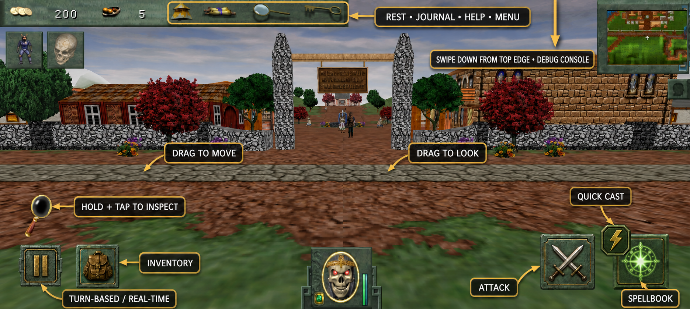
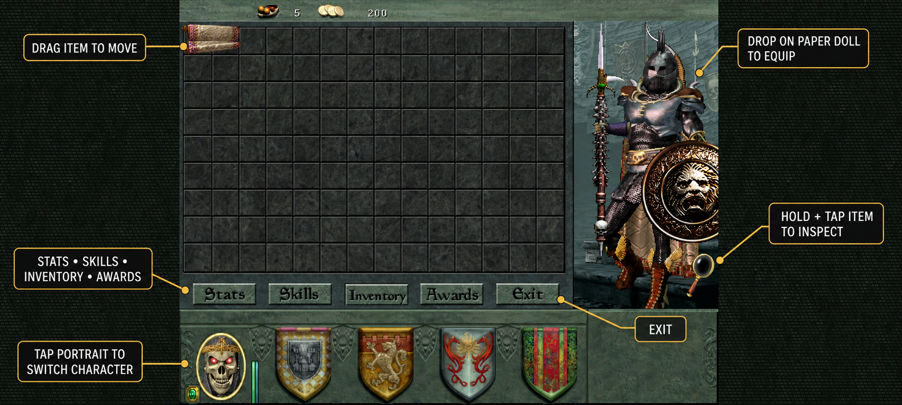
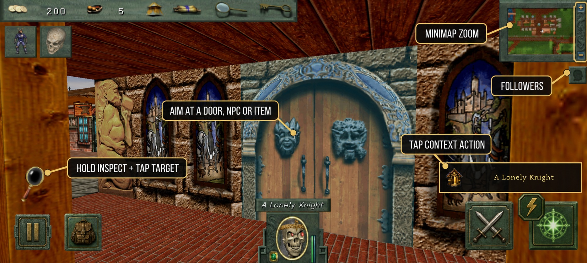
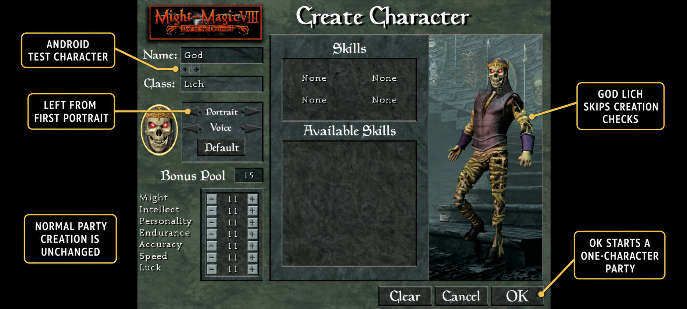

# OpenYAMM Android UI

### 1. Gameplay controls

- Drag from the lower-left play area to open the virtual joystick. It resolves to the eight WASD-style directions,
  with a slight preference for straight movement.
- Drag in the right play area to look and turn.
- Hold the magnifying glass with one finger and tap a target with another to inspect it. Releasing the magnifying
  glass returns to normal play.
- Pause toggles turn-based and real-time play. The icon changes to indicate the available mode switch.
- Attack and Quick Cast execute when released, not continuously while held.
- Quick Cast casts the selected quick spell; if none is selected, it performs a normal attack.
- The green magic button opens the spellbook.
- The top utility bar provides Rest, Journal, Quick Reference, and Menu alongside Gold and Food.

### 2. Inventory and equipment

- Touch and drag an item to move it. Release over a valid inventory cell to place or swap it.
- Release suitable equipment over the paper doll to equip it.
- If the destination is invalid, the item remains held so it can be placed somewhere else.
- Hold the magnifying glass and tap an item to inspect it without moving it.
- Tap a party portrait to change the active character.
- The same inspection modifier is available in relevant inventory, chest, and merchant item views.

### 3. Context-sensitive interaction

- Aim at a usable door, NPC, item, chest, corpse, mechanism, or map event to reveal a context action.
- Tap the context action to interact with the selected target.
- When an item is held during gameplay, this area becomes a **Drop item** action.
- The small head button toggles the follower panel; the minimap frame provides zoom controls.
- Fly Up and Fly Down controls appear at the right edge only while outdoors with the Fly party buff active.

### 4. Android test character

- Normal party creation and its completion checks remain unchanged.
- On Android, the God Lich test character is appended as the final portrait. Pressing the left portrait arrow from
  the first normal portrait wraps directly to it.
- Confirming the God Lich bypasses normal creation checks and starts with that character alone.
- Selecting any normal portrait continues through the standard party-creation path.

## Controls reference

| View | Gesture or control | Result |
| --- | --- | --- |
| Gameplay | Drag lower-left play area | Eight-direction movement joystick |
| Gameplay | Drag right play area | Look and turn camera |
| Gameplay | Tap context action | Use the currently targeted world interaction |
| Gameplay | Hold magnifier + tap target | Inspect while the world is frozen |
| Gameplay | Pause/Play | Toggle turn-based and real-time play |
| Gameplay | Crossed swords | Normal attack on release |
| Gameplay | Lightning badge | Quick Cast on release; normal attack if no quick spell is set |
| Gameplay | Green magic button | Open spellbook |
| Gameplay | Backpack | Open character inventory |
| Gameplay | Head button | Toggle follower panel |
| Gameplay | Fly arrows | Ascend or descend; visible only outdoors with Fly active |
| Item views | Drag item | Move, place, swap, or equip an item |
| Item views | Hold magnifier + tap item | Inspect item |
| Character creation | Portrait arrows | Cycle available characters |
